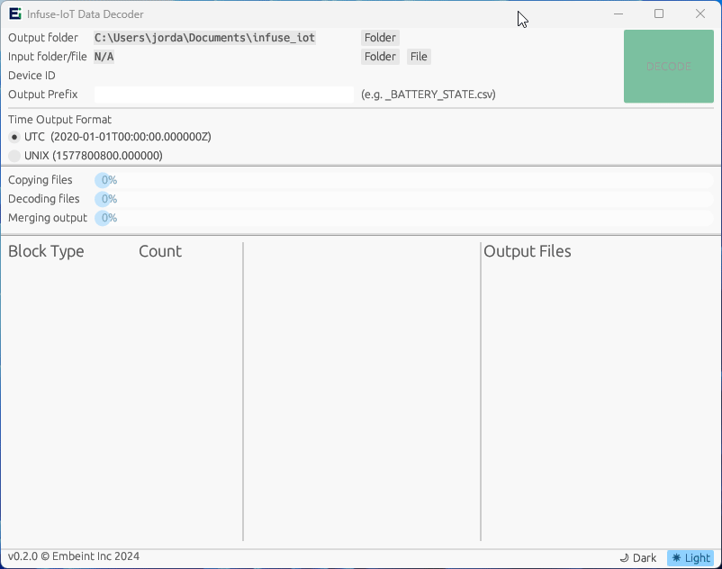
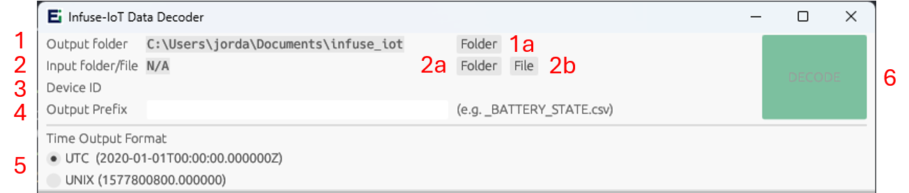
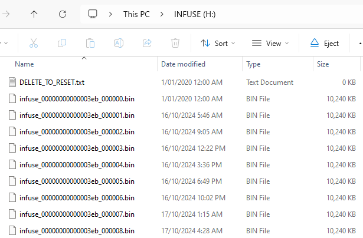

# Data Logger Decoder

The Infuse-IoT Data Decoder is a tool that enables decoding data directly from SD cards or from historical deployment files. It is available in both GUI and command line forms.

  

## Configuration Options

The application provides options to control the input selection and output generation.

  

### 1) Output Folder

This field controls where the output data will be placed after decoding. It defaults to $USER_HOME/infuse_iot. The output folder can be updated by clicking `Folder` (1a).

### 2) Input folder/file

This field specifies the source of the input data. This can be either a SD card filesystem (2a) or a previously output binary file (2b).

When an SD card is inserted into the computer, it will appear as a removable disk named INFUSE. This is the folder to select from button 2a.

### 3) Device ID

If data from multiple Tauro collars exists on a single SD card, this option will transform into a drop down menu to control which data set to decode. If SD cards are not reused across collars, this option will be greyed out.

### 4) Output Prefix

This field controls the prefix of the output filenames, created in the output folder. This value will default to the Device ID.

### 5) Time Output Format

This option controls the output format of the timestamps written into the output CSV files. The two options are a [RFC3339](https://www.rfc-editor.org/rfc/rfc3339) formatted string (for example 2024-06-27T13:55:12.123456Z), or a Unix timestamp with subseconds (for example 1731457165.123456).

The RFC3339 option is recommended if the CSV outputs will be looked at by users, as it is a more human-readable format. By comparison, the Unix timestamps are simpler for data processing scripts to parse, and are faster for the decoder tool to generate.

### 6) Decode
Once an input file or folder has been selected, the decode button becomes available to select. Clicking this button begins the decode process with the currently selected options. The button is unavailable to select again until the previous decode has completed.

## Decoding Process

### 1) Copying files

The data on the SD card is copied onto the local filesystem to create the merged output binary and ensure fast data access times for the decoding and merging steps.

### 2) Decoding files

The binary data format is decoded into human-readable CSV files. This process is run across all CPU cores to maximize performance. 

### 3) Merging output

The individual CSV files created by each thread in the decoding step are merged back together into a single file per sensor stream.

## Output Statistics

Once complete, the tool will display statistics about the decoded data for initial validation.

### Block Type

This column lists the different types of data that were found on the SD card. TDF is the primary data storage block. A small number of empty blocks are expected on all decodes due to the data storage implementation on the embedded devices.

### TDF

This column contains a count of the individual TDF types that were decoded. Basic validation can include how many times the device rebooted (60 in the demo gif), and that the amount of accelerometer and gyroscope data is approximately equal, as they both run at 120Hz.

If the SD card contains data from other devices (`TDF_REMOTE`), counts for each TDF from the other device will be displayed as a separate count.

### Output Files

This column lists the output files that were generated, and should contain a single file for each TDF in the previous column in addition to the single merged .bin file.

## SD Card Information

Infuse-IoT use SD cards with an NTFS filesystem for compatibility with the 3 major operating systems. If the application detects that the filesystem is not as it expects, the SD card will be erased and reformatted with NTFS.

> [!WARNING]  
> This WILL result in the loss of any data previously stored on the SD card. Existing data MUST be backed up before an SD card is used with Tauro collars.

### Stored Data

Data is stored on the filesystem in binary containers for space efficiency. Each container is of a fixed size, and timestamped with the creation time. These timestamps can be used to validate that the data logging frequency is consistent across time (1 container every 3 hours in this example). The very first container will likely have an incorrect timestamp due to the collar not knowing the time on boot.

  

### Resetting the SD card

Resetting a previously used SD card is as simple as deleting the `DELETE_TO_RESET.txt` file in the previous image. If that file does not exist on the filesystem at boot, the application will erase the SD card and re-format it.
